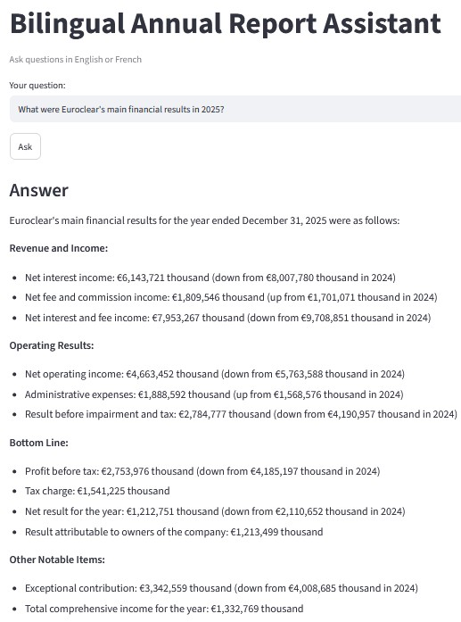
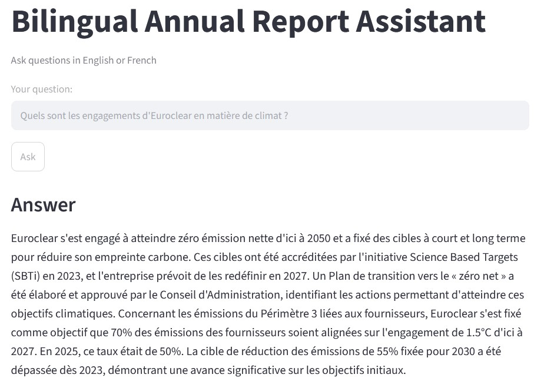

# Bedrock Bilingual RAG

Ask questions in **English or French** about company annual reports.
Built on Amazon Bedrock Knowledge Bases with Claude.

## Demo

**English question**

**French question**

## How it works

PDFs → S3 → Bedrock Knowledge Base (Titan Embeddings V2 + S3 Vectors) → Claude Haiku 4.5 → answer with sources

## Tech stack

Python · boto3 · Amazon S3 · Bedrock Knowledge Bases · S3 Vectors · Claude · Streamlit

## Run it

1. `pip install -r requirements.txt`
2. Copy `.env.example` to `.env` and fill in your values
3. `python src/upload.py` (uploads the PDFs)
4. `streamlit run app.py`

## Findings so far

- English questions: complete answers with citations.
- French questions: answered in French but retrieved fewer relevant chunks.
- Out-of-scope questions: refused, with no hallucination.

## Next steps

- Compare `numberOfResults` (1, 3, 5, 10)
- Custom prompts: answer language and JSON output
- Compare Titan vs Cohere Multilingual embeddings
